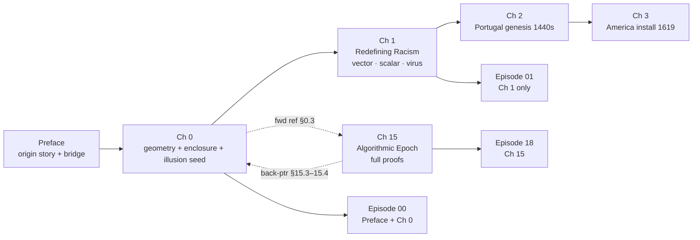

# Integration Plan: Manuscript + Episode 0 (Gemini Thread v2)

> **Reading guide:** This plan is written in five executable phases.
> Each phase is self-contained and can be handed to a separate work session.
> Phases 1–3 are manuscript-only. Phase 4 is podcast-only. Phase 5 is verification.

---

## Anchor Points in the Current Repo

| Item | File / Location |
|------|-----------------|
| `\chapter{Redefining Racism}` — current Ch 1 open | `Paper/Redefining_Racism.tex` |
| Tri-Modal block (`\subsection{The Tri-Modal…}`) | ~L247–L273, `\label{sec:trimodal}` |
| Abulhawa / vector-vs-scalar paragraph | ~L1147 with `\cite{abulhawa}` |
| Convex Hull / integer-containment theorem | ~L4831–L4839, `\label{thm:integer-convergence}` |
| §15.3.1 Orthogonal Vector Injection | ~L11561 in `ch:algorithmic_epoch` |
| §15.4 Perfect Eclipse | ~L11592 in `ch:algorithmic_epoch` |
| Preface "tiers defer to history" paragraph | ~L122–L124 (conflicts with Ch 0) |
| Episode 00 prompt | `podcast_prompts/Episode_00_How_to_Read_This_Book.md` |
| Episode 01 prompt | `podcast_prompts/Episode_01_Redefining_Racism.md` |
| Series root fragment | `podcast_prompts/00_ROOT_SERIES_FRAGMENT.md` |
| Build script | `podcast_prompts/build_full_series_prompt.sh` |

**Note on "Chapter 9" from the Gemini thread:** The Convex Hull formal theorem
is not in a chapter numbered 9 in the current file; it sits in the integer-
containment / network-mathematics block around L4831. Always cite by
`\label{thm:integer-convergence}`, never by hard-coded chapter number.

---

## Phase 1 — Manuscript: Chapter 0 + Preface Bridge

### 1-A. Insert Chapter 0: System Initialization

**Goal:** A purely abstract "geometry + trap + illusion" layer sitting *before*
`\chapter{Redefining Racism}`. No Portuguese timeline, no American timeline,
no specific demographic variables yet — those belong in Ch 1 (racism as primary
example) and Ch 2 (Portugal genesis) respectively.

**LaTeX mechanics**

Place the new chapter immediately after `\mainmatter` (or after Part I's
`\part{…}` declaration if one exists):

```latex
\setcounter{chapter}{-1}
\chapter{System Initialization: The Geometry of Extraction}
\label{ch:system_init}
```

The following `\chapter{Redefining Racism}` will then print as **Chapter 1**
via normal `thechapter` semantics. All subsequent chapter numbers shift by +1;
fix cross-references in Phase 2.

**Proposed section flow**

#### §0.1 — The Five Nodes and the 3-D Pyramid

Introduce the five structural actors using *general* notation (specialize to
$O_{\text{racialized}}$ only when Ch 1 loads the race dataset):

- $E$ — Elite (apex)
- $P_{\text{uppet}}$ — Puppet Class
- $F_{\text{enforce}}$ — Enforcement Class
- $I_{\text{buffer}}$ — Buffer Class
- $O$ — Out-group (general)

Frame the hierarchy as a **3-D pyramid**, not a flat 2-D triangle. Explain that
the geometry has been conventionally depicted as a 2-D "pyramid of white
supremacy" — but the 3-D model is required to explain the optical illusion the
system depends on (developed in §0.3).

#### §0.2 — The Tri-Modal Enclosure Model *(moved from Ch 1)*

*Move* the entire block currently at ~L247–L273 (Tri-Modal subsection, display
equations for $\mathcal{S}_{\text{enc}} = \frac{1}{3}\sum_{i=1}^{3} e_i$,
total-enclosure corollary, "reforms fail" paragraph) into this section.

Keep `\label{sec:trimodal}` on the subsection so all existing `\ref{sec:trimodal}`
pointers in Ch 15 and elsewhere remain valid.

Add a one-sentence forward pointer in the position where the block used to be
in Ch 1:

> *The Tri-Modal Enclosure Model ($\mathcal{S}_{\text{enc}}$, §\ref{sec:trimodal})
> is developed in Chapter~\ref{ch:system_init} and applied throughout.*

**Convex-hull foreshadow (add at end of §0.2)**

Add a short paragraph before closing §0.2:

> Geometrically, the three enclosure modes $e_1, e_2, e_3$ behave as bounding
> hyperplanes — the constraints that define the smallest convex region containing
> the Out-group's feasible state space. In computational geometry this structure
> is the **Convex Hull**: the tightest enclosure whose interior offers no escape
> vector. The formal correspondence between $\mathcal{S}_{\text{enc}}$ and the
> integer-order containment hull $\operatorname{Co}(q^L)$ is established in
> Theorem~\ref{thm:integer-convergence} (the rubber-band / pegboard intuition:
> each $e_i \to 1$ tightens one edge of the band until the enclosed volume
> collapses to zero).

#### §0.3 — Elite Obscuration and the Orthographic Illusion

This section *seeds* vocabulary that receives its full formal proof in §15.3–15.4;
present only Tier-3/ordinal definitions here with a pointer to Ch 15.

**Key concepts to define (ordinal/structural tier):**

1. **Orthographic Projection / "Square Ceiling"**
   — When an observer inside $O$ looks upward through a 3-D pyramid, the laws
   of orthographic projection collapse the 3-D geometry into a 2-D plane. The
   observer sees only the flat ceiling of $I_{\text{buffer}}$ pressing directly
   down — not the apex $E$. This creates the *optical illusion of the 2-tier
   binary*: the false perception that society is simply Oppressor vs. Oppressed.
   The illusion is a structural output of the observer's position, not a cognitive
   failure.

2. **Elite Obscuration**
   — The engineered alignment of $P_{\text{uppet}}$, $F_{\text{enforce}}$, and
   $I_{\text{buffer}}$ along a single angular line of sight from $O$'s vantage
   point, making $E$ optically indistinguishable from its proxies. Full geometric
   treatment (the $\theta$-collapse equations) is in §\ref{sec:perfect_eclipse}.

3. **Orthogonal Deflection** *(the kinematic name for the injection operator)*
   — The system converts vertical class momentum (Out-group kinetic energy aimed
   upward toward $E$) into horizontal identity conflict (energy scattered laterally
   between $O$ and $I_{\text{buffer}}$) by stripping the $z$-component from the
   momentum vector and projecting it onto the $x$-$y$ plane. The full graph-
   theoretic operator $\mathcal{E}$ (and its $\lambda_2$ signature) is proved in
   §\ref{sec:orthogonal_injection}. Seeded here as the *kinematic reading*.

4. **Kinetic Decoy**
   — The functional role $I_{\text{buffer}}$ plays in absorbing Out-group
   kinetic energy that would otherwise travel up the $z$-axis toward $E$.
   Note: the existing notation $P_{\text{gaslight}}$ (policy gaslighting) is
   *preserved* where it already appears; "Kinetic Decoy" is the structural-
   physics name for the same routing problem. Add one cross-sentence:
   > *Policy gaslighting ($P_{\text{gaslight}}$) is the institutional face of
   > the Kinetic Decoy: the system's narrative infrastructure encodes the
   > misdirection in law and discourse so it outlasts any single enforcement event.*

**Scholar pins (lightweight — one bridging sentence or footnote each):**

- **Du Bois** — the "psychological wage" (*Black Reconstruction*, 1935) is the
  first empirical documentation of the Kinetic Decoy: the suppression allocation
  paid to $I_{\text{buffer}}$ to keep it aligned with $E$ against $O$. Full
  treatment: §\ref{sec:dubois_wage}.
- **Fanon** — *The Wretched of the Earth* (1963) documents the kinetic logic of
  $F_{\text{enforce}}$ and the psychological fracturing of $O$. Full treatment:
  later chapters.
- **Firmin** — *The Equality of the Human Races* (1885) is the first systematic
  attack on the Institutional Feedback Loop ($P_{\text{gaslight}}$ at the
  epistemic level): European pseudo-science was being used to legitimize the
  racial partition as natural. Full treatment: Ch 2.

**Note on "P-Gaslighting" nomenclature**

Do not wholesale rename $P_{\text{gaslight}}$ — it is already established
notation throughout the manuscript and cited in existing equations. The Gemini
thread introduced "Elite Obscuration," "Kinetic Decoy," and "Orthogonal
Deflection" as *physics-layer* names for aspects of the same mechanism.
Add these as aliases/elaborations; keep $P_{\text{gaslight}}$ in all places
it already exists.

### 1-B. Preface Bridge Patch (~L122–L124)

Replace the current "preface only names tiers; formal definitions come as history
requires" paragraph with a bridge that matches the new pipeline:

**Replacement prose (clinical / "psychosocial software" register):**

> Before the historical timeline begins, *Chapter 0: System Initialization*
> compiles the abstract geometry of the trap: the five structural nodes, the
> three-mode enclosure that contains them, and the optical illusion that makes
> the architecture invisible from inside it. Chapter~\ref{ch:redefining} then
> loads racism as the primary empirical dataset — defining the software before
> running its execution history. The historical compile begins in
> Chapter~\ref{ch:portugal} and is instantiated on American hardware in
> Chapter~\ref{ch:bacon}.

**Also add the origin-story arc (optional box or opening paragraph):**

> This framework did not arrive fully formed. It began as hand-written summations
> of a standard 2-tier binary — Oppressor vs. Oppressed. The equations broke.
> The model expanded to three tiers to account for the Elite's separation from
> the broader In-group. Three tiers broke. The law required a Puppet Class; the
> carceral state required an Enforcement Class. The 5-tier architecture is not
> an imposed theoretical preference — it is the minimum configuration the
> mathematics required to remain internally consistent with the historical record.

**Rawls / Veil of Ignorance (if adding to print as well as audio):**

Place a short callout box in the Preface or at the start of Ch 0 with correct
attribution:

> *Reader instruction:* As you move through this framework, practice what
> philosopher John Rawls called the **Veil of Ignorance** (*A Theory of Justice*,
> 1971): evaluate the system from an "original position" in which you do not know
> which tier you will occupy. Rawls built this thought experiment on Kantian moral
> foundations, but its application here is diagnostic rather than prescriptive:
> if you would not consent to boot into this operating system at a random tier,
> the system is structurally broken — regardless of where you actually landed.

---

*Phase 1 complete. Proceed to Phase 2 for cross-reference cleanup and Ch 1 patch.*

---

## Phase 2 — Cross-Reference Cleanup and Chapter 1 Patch

### 2-A. Chapter 1 Opening (after Tri-Modal move)

After moving §0.2 to Ch 0, Ch 1 (`ch:redefining`) must open without the
Tri-Modal block. Required edits:

1. **Delete** the Tri-Modal subsection body from its current ~L247–L273 position.
2. **Insert** the forward-alias sentence at that location:
   ```latex
   % Tri-Modal Enclosure Model developed in Ch.~\ref{ch:system_init}, \S\ref{sec:trimodal}.
   The Tri-Modal Enclosure Model ($\mathcal{S}_{\text{enc}}$,
   \S\ref{sec:trimodal}) is the topological framework applied throughout this
   analysis; its derivation precedes this chapter in
   Chapter~\ref{ch:system_init}.
   ```
3. The rest of Ch 1 — racism as primary example, the causal reversal, the
   vector-vs-scalar distinction, the diagnostic model / fractal mind virus
   architecture — remains **unchanged in intent and order**.

**Susan Abulhawa credit (verify it's in place):**

The existing paragraph at ~L1147 already contains `\cite{abulhawa}`. Verify the
surrounding prose explicitly credits her for the directional-vector conceptualization:

> *The framing of racism as a directional vector — not merely a scalar attitude
> — was articulated by Palestinian-American author and activist Susan Abulhawa.
> The framework here formalizes that conceptual insight into the set-theoretic
> machinery developed across this chapter.*

If this phrasing is absent, add it as a one-sentence attribution before the
`\cite{abulhawa}` call.

### 2-B. Hard-Coded Chapter Number Fixes

Inserting Ch 0 shifts all subsequent chapter numbers by +1 in the PDF, but
LaTeX `\ref{}` values update automatically — the problem is **hard-coded
strings** like `Chapter~2` or `see Chapter 3`.

**Grep targets (run before and after the insert):**

```bash
grep -n "Chapter~[0-9]" Paper/Redefining_Racism.tex | head -60
grep -n "chapter [0-9]" Paper/Redefining_Racism.tex -i | grep -v "\\\\chapter{" | head -40
```

**Known locations to fix manually:**

| Approx. line | Current text | Fix |
|---|---|---|
| ~L305 | `Chapter~2` (Portugal ref) | `Chapter~\ref{ch:portugal}` |
| ~L310 | `Chapter~3` (Bacon ref) | `Chapter~\ref{ch:bacon}` |
| ~L770 | any hard-coded chapter N | replace with `\nameref` or `\ref` |
| ~L1227 | any hard-coded chapter N | replace with `\nameref` or `\ref` |
| ~L12498–L12506 | equation registry footnotes referencing `Chapter~1` equations | update to `\eqref{…}` labels |

**Labels to assign if not yet present:**

```latex
\label{ch:portugal}   % on \chapter{Initializing the Vector…}
\label{ch:bacon}      % on \chapter{The American Instantiation…}
```

### 2-C. Equation Number Drift

The manuscript uses `\numberwithin{equation}{chapter}`. Moving the Tri-Modal
equations from Ch 1 into Ch 0 will renumber them from `(1.x)` to `(0.x)`.

**After the move, grep for broken textual equation references:**

```bash
grep -n "eq:1\." Paper/Redefining_Racism.tex
grep -n "(1\.[0-9])" Paper/Redefining_Racism.tex
```

Replace any textual `(1.1)` / `(1.2)` references to the Tri-Modal equations
with `\eqref{eq:trimodal_score}` (or whichever label is on those equations).
Assign labels to the equations if they don't already have them:

```latex
\begin{equation}\label{eq:trimodal_score}
  \mathcal{S}_{\text{enc}} = \frac{1}{3}\sum_{i=1}^{3} e_i
\end{equation}
```

---

## Phase 3 — Chapter 15 Patches (§15.3.1, §15.4, §15.4.1)

These sections already contain the rigorous proof layer
($\mathcal{E}$ operator, $\lambda_2$ signature, $\theta$-collapse, decoy vertex).
Phase 3 *adds* the geometric/perceptual vocabulary from the Gemini thread without
replacing or weakening any existing equations.

### 3-A. §15.3.1 — Geometry of the Injection

**Add before the existing `\mathcal{E}(G(t))` display equation:**

```latex
Geometrically, the kinetic energy of $O$ naturally forms a momentum vector
$\vec{v}$ aimed upward along the $z$-axis toward the Elite ($E$) at the apex.
The injection operator $\mathcal{E}$ applies a projection that strips the
$z$-component entirely, deflecting the force at 90 degrees onto the flat
$x$-$y$ plane — the horizontal stratum shared by $O$ and $I_{\text{buffer}}$.
This is \textbf{Orthogonal Deflection}: the kinematic reading of the graph-
theoretic operator below. (The seeded definition in
Chapter~\ref{ch:system_init}, \S0.3 is the intuitive form; the operator here
is the formal proof.)
```

**Change the section's first descriptive sentence** from:

> "The algorithmic upgrade sidesteps this error by replacing vertical friction
> with a horizontal vector injection."

To:

> "The algorithmic upgrade sidesteps this error by replacing vertical friction
> with an engineered \textbf{Orthogonal Deflection} — the $\mathcal{E}$
> operator defined below."

Everything else in §15.3.1 (the $\mathcal{E}$ display equation, the
$\lambda_2$ reduction, the footnote validating via the Southern Strategy)
remains unchanged.

### 3-B. §15.4 — The Perfect Eclipse → Elite Obscuration

**Retitle the section** (update `\section{…}` and `\label{sec:perfect_eclipse}`):

```latex
\section{Elite Obscuration: The Perfect Eclipse and the Orthographic Projection}
\label{sec:perfect_eclipse}
```

**Insert before the existing $\theta$-collapse paragraph** (before "Model the
hierarchy geometrically in the Out-group's perception field"):

```latex
To understand why this alignment is structurally inevitable, we must model
the hierarchy not as a flat 2-D triangle but as a fully realized \textbf{3-D
Pyramid}. Place $E$ at the apex along the $z$-axis; place $P_{\text{uppet}}$,
$F_{\text{enforce}}$, and $I_{\text{buffer}}$ at descending structural layers.

An observer in $O$, physically enclosed beneath the pyramid, looks upward
along the vertical axis. By the laws of \textbf{orthographic projection} — the
geometric rule by which a 3-D structure collapses into a 2-D plane as a
function of the observer's angle — the pyramid's apex disappears. The observer
perceives only the flat 2-D ceiling pressing directly downward: $I_{\text{buffer}}$.
This is the \textit{optical illusion of the 2-tier binary}. It is not a
perceptual failure; it is the mathematically necessary output of the observer's
position inside the structure.

The only way to perceive the full 3-D pyramid is to step \textit{outside} it —
which is precisely what the Tri-Modal Enclosure ($\mathcal{S}_{\text{enc}}$,
Chapter~\ref{ch:system_init}) is engineered to prevent. The enclosure and the
optical illusion are therefore mutually reinforcing: the trap hides its own
architecture from the inside.

\textbf{Elite Obscuration} is the perceptual correlate of the $\theta$-collapse
proved below. The algorithmic governance system continuously rotates class
coordinates to maintain the angular alignment:
```

Then keep the existing $\theta_E = \theta_{P} = \theta_{F} = \theta_{I}$ equation
(15.5) and all subsequent content unchanged.

**Add a back-pointer sentence at the end of §15.4:**

```latex
The vocabulary seeded in Chapter~\ref{ch:system_init} (\S0.3) — Elite
Obscuration, Orthographic Projection, Orthogonal Deflection — is the ordinal/
structural layer for which this section provides the formal geometric proof.
```

### 3-C. §15.4.1 — The Decoy Vertex

No structural changes needed. Add one sentence after the opening description
of the Puppet Class as Decoy Vertex:

```latex
Each layer of the 3-D Pyramid serves as an additional energy-absorption stratum:
when $O$'s kinetic energy is sufficient to pierce the $I_{\text{buffer}}$ ceiling,
it encounters $P_{\text{uppet}}$ next — another engineered shock absorber that
grounds outrage into bureaucratic friction before any of it can reach the $E$
apex along the $z$-axis.
```

Everything else in §15.4.1 (the $\partial\max/\partial K(t) \approx 0$ equation,
the Occupy Wall Street instantiation, the Kdecoy capacity analysis) remains
unchanged.

---

*Phases 1–3 complete. Proceed to Phase 4 for podcast updates.*

---

## Phase 4 — Podcast: Episode 00, Episode 01, and ROOT Fragment

### 4-A. Episode 00 — Expand Scope to Cover Chapter 0

The current `Episode_00_How_to_Read_This_Book.md` covers only the Preface and
methodology. After Phase 1, Episode 0 now maps to **Preface + Chapter 0**,
making it the full orientation and geometry layer.

**Serialization block — replace current scope with:**

```
This is Episode 0. Cover:
  (a) the Preface (origin story, dependency-map framing, clinical-detachment rationale)
  (b) Chapter 0 / System Initialization (five nodes, Tri-Modal Enclosure,
      Elite Obscuration seed, Orthogonal Deflection seed, Convex-Hull intuition)

DO NOT enter Chapter 1 content (causal reversal, vector-vs-scalar, fractal
mind virus) — those belong to Episode 1.
```

**New content blocks to add to the Episode 00 Content Guide:**

1. **The 3-D Pyramid and Five Nodes** — AI hosts introduce $E$, $P_{\text{uppet}}$,
   $F_{\text{enforce}}$, $I_{\text{buffer}}$, $O$ using pyramid geometry.
   Keep $O$ general (not yet $O_{\text{racialized}}$ — Ch 1 loads the race dataset).

2. **The Tri-Modal Enclosure** — $\mathcal{S}_{\text{enc}}$, the three $e_i$ modes,
   and the reform-failure math (lowering one mode while others stay at 1.0 does
   not liberate; the hull reshapes). Use the diversity-hire numeric example.

3. **Elite Obscuration and the Square Ceiling** — orthographic projection:
   looking up from inside the pyramid you see only the flat 2-D $I_{\text{buffer}}$
   ceiling, not the $E$ apex. Seed "Orthogonal Deflection" as the mechanism.

4. **Convex Hull Intuition** — the three $e_i$ modes behave like a rubber band
   snapping around the Out-group's feasible state space. Formal theorem appears
   later in the series.

**Author-track interjection triggers (add as new section in the prompt):**

```markdown
### Author Interjection Triggers (Episode 0)

**Trigger 1 — After hosts explain Square Ceiling:**
Author: "The system is engineered to make you think that 2-D ceiling is the
entire machine. That is Elite Obscuration. The confusion is geometrically
inevitable — not a personal failure."

**Trigger 2 — After reform-failure math:**
Author: "This is why I stay detached. Anger at the Buffer Class spends kinetic
energy attacking the ceiling — exactly what Orthogonal Deflection is engineered
to make you do. Hating $I_{\text{buffer}}$ at any intersection is the Kinetic
Decoy working perfectly."

**Trigger 3 — Veil of Ignorance (author introduces directly — NOT the AI):**
Author: "Use a specific diagnostic tool. John Rawls called it the Veil of
Ignorance — evaluate this system from an original position where you have no
idea which tier you will occupy. Would you consent to run this code? Practice
radical empathy as a diagnostic tool. Step behind that veil every time the AI
introduces a new tier."
(Correct attribution: Rawls, A Theory of Justice, 1971 — built on Kantian
foundations. Not Kant directly.)

**Trigger 4 — Fractal Scaling Guardrail (after five-node introduction):**
Author: "$E$, $P_{\text{uppet}}$, and $F_{\text{enforce}}$ are structurally
stable across all scales. What changes is which demographic groups fill
$I_{\text{buffer}}$ and $O$. The interference engine runs the same algorithm;
it swaps the demographic variables."
```

**Update Episode 00 sign-off:**

> "Next time, we load racism as the primary dataset into the machine we just
> initialized. Episode 1 opens Chapter 1 and introduces the causal reversal —
> the arrow that most definitions get completely backwards."

### 4-B. Episode 01 — Update IF-EPISODE-0-WAS-USED Clause

**Replace the current clause with:**

```markdown
**IF EPISODE 0 WAS USED:** The following are ALREADY COVERED — do not re-explain:
- The five-tier hierarchy (nodes and 3-D pyramid)
- The Tri-Modal Enclosure Model ($\mathcal{S}_{\text{enc}}$, $e_i$)
- Elite Obscuration and the orthographic projection / square ceiling
- Orthogonal Deflection (seeded — not yet formally proved)
- Kinetic Decoy (seeded)
- The Veil of Ignorance / Rawls attribution
- Radical empathy as a diagnostic tool
- Fractal scaling guardrail ($E$/$P$/$F$ stable; $I_{\text{buffer}}$/$O$ variable)
Re-anchor only as "as established in Episode 0" when needed for legibility.
```

**Update Content Guide item 6 (Tri-Modal):**

Change from a full introduction to:

```markdown
6. **Tri-Modal Enclosure — Already Covered (Episode 0)**
   Episode 1 applies the model to racism as the primary empirical case. Do not
   re-derive equations; reference as established in Episode 0.
```

**Add Abulhawa interjection trigger:**

```markdown
**Trigger — Vector vs. Scalar (Abulhawa Credit):**
After hosts introduce the scalar/vector distinction, author delivers:
"Credit where it's due. The explicit conceptualization of racism as a
directional vector was articulated by Palestinian-American author Susan Abulhawa.
What I've done is formalize that insight into set-theoretic machinery. When
people analyze oppression clearly — whether in America or Palestine — they
arrive independently at the same geometric laws."
```

### 4-C. 00_ROOT_SERIES_FRAGMENT — Add Batch G

Insert after Batch F in `00_ROOT_SERIES_FRAGMENT.md`:

```markdown
**Batch G — Chapter 0 / Gemini Thread Vocabulary**

- **Elite Obscuration** [Ep 0 seed, proved Ep 18]: Engineered angular alignment
  of $P_{\text{uppet}}$, $F_{\text{enforce}}$, $I_{\text{buffer}}$ making $E$
  optically indistinguishable from its proxies. Ordinal in Ch 0; proved via
  $\theta$-collapse in §15.4.

- **Orthographic Projection / Square Ceiling** [Ep 0, proved Ep 18]: 3-D pyramid
  collapses to 2-D plane for an observer inside it. Out-group sees only the
  $I_{\text{buffer}}$ ceiling, not $E$ apex. Structural output of position,
  not perceptual failure.

- **Orthogonal Deflection** [Ep 0 seed, proved Ep 18]: Kinematic name for
  $\mathcal{E}$ operator — strips $z$-component from class momentum vector,
  deflects onto horizontal $x$-$y$ plane. Full proof §15.3.1.

- **Kinetic Decoy** [Ep 0]: Functional role $I_{\text{buffer}}$ plays in
  absorbing Out-group kinetic energy. Physics-layer alias for the routing
  problem that $P_{\text{gaslight}}$ names at the narrative/institutional layer.
  $P_{\text{gaslight}}$ notation preserved throughout.

- **Convex Hull / Bounding Hyperplanes** [Ep 0 intuition, formal Ep 10]: The
  three $e_i$ modes as bounding hyperplanes; formal correspondence with
  $\operatorname{Co}(q^L)$ in `thm:integer-convergence`. Do not re-derive.

- **Radical Empathy as Diagnostic Tool** [Ep 0]: Author's instruction to apply
  Rawls's Veil of Ignorance (correct: Rawls 1971, built on Kant) at each tier
  introduction. Author introduces this — AI hosts do not.

- **Fractal Scaling Guardrail** [Ep 0]: $E$/$P_{\text{uppet}}$/$F_{\text{enforce}}$
  structurally stable across scales; $I_{\text{buffer}}$/$O$ swap demographics
  by intersection. AI hosts must not symmetrically remap all tiers when scaling.

- **System Administrator Tone** [Ep 0 onwards]: Author voice is calm, clinical,
  authoritative, slightly detached — prerequisite for reverse-engineering a
  system whose brutality would otherwise prevent clear analysis.
```

**Also fix the manuscript title string in the Series Overview:**

Change `*Redefining Racism: The Mathematics of Oppression…*` to:

`*The Mathematics of Oppression: A Set-Theoretic Framework for Analyzing Systems
of Domination* (Emmanuel Theodore). ["Redefining Racism" is the title of Chapter 1,
not the book.]`

**Regenerate bundle after all edits:**

```bash
cd /Users/emmanuel/Documents/Theory/Redefining_racism/podcast_prompts
./build_full_series_prompt.sh
```

---

## Phase 5 — Build Verification and Risk Checklist

### 5-A. LaTeX Build

```bash
cd /Users/emmanuel/Documents/Theory/Redefining_racism
latexmk -pdf Paper/Redefining_Racism.tex 2>&1 | grep -E "(Warning|Error|undefined)"
```

**Expected warnings to resolve:** undefined refs for `ch:system_init`,
`ch:portugal`, `ch:bacon`; equation registry footnotes after Tri-Modal renumber.

### 5-B. Grep Checklist

```bash
grep -n "Chapter~[0-9]" Paper/Redefining_Racism.tex
grep -n "eq:1\." Paper/Redefining_Racism.tex
grep -n "label{sec:trimodal}" Paper/Redefining_Racism.tex
```

### 5-C. Content Boundary Check (Chapter 0)

- [ ] No historical dates or specific demographics before Ch 1 boundary
- [ ] $O$ remains general throughout Ch 0 (no $O_{\text{racialized}}$ specialization)
- [ ] All three $e_i$ examples remain abstract (no redlining/Jim Crow)
- [ ] Scholar pins are single bridging sentences only — no full analysis
- [ ] Convex Hull paragraph cites by label, not "Chapter 9" string

### 5-D. Podcast Sanity Check

- [ ] Episode 00 sign-off teases Episode 1 (not Episode 2)
- [ ] Episode 01 IF-EPISODE-0-WAS-USED clause lists all Batch G terms
- [ ] No episode re-derives Tri-Modal equations (Ep 00 owns them)
- [ ] Abulhawa credit is in Episode 01 author-track, not Episode 00
- [ ] Rawls/Veil attribution correct in every episode that uses it

---

## Architecture Diagram


