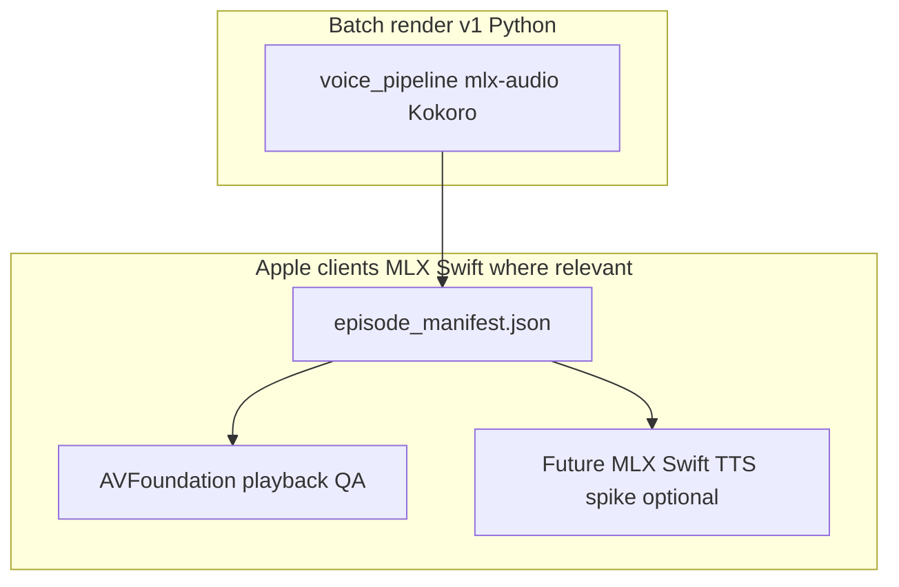
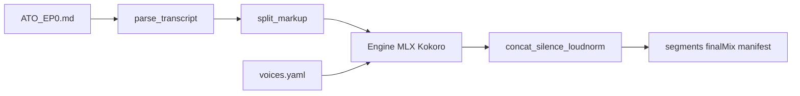

# MLX-first local TTS pipeline (ATO Episode 0)

## Terminology and deliverables

- Avoid **master** / **slave** in filenames, variables, and docs. Use **final mix**, **combined episode**, or **stitched program audio** for the single delivered WAV/MP3 derived from segments.
- **Suggested output filenames** (replacing e.g. `*_master.wav`): `ATO_EP0_episode.wav` and `ATO_EP0_episode.mp3` (or `ATO_EP0_final_mix.*` if you prefer explicit “mix” language). Same pattern for future episodes.

## Context from the repo

- **Transcript format**: [Architecting_the_operation/ATO_EP0.md](Architecting_the_operation/ATO_EP0.md) uses one speaker line per turn: `Emmanuel Theodore (MM:SS)` / `AI 1 (MM:SS)` / `AI 2 (MM:SS)`, with dialogue on the following line(s) until the next speaker line. A short title/intro block appears before the first speaker match. There is **no** `[pause:]` / `[tone:]` markup in the file **yet**; the pipeline should support injecting these later without breaking plain text.
- **Greenfield**: No existing [`voice_pipeline/`](voice_pipeline/) module; [`Paper/scripts/requirements.txt`](Paper/scripts/requirements.txt) already includes `pyyaml` (paper venv pattern: [Makefile](Makefile) `venv` target).
- **Upstream API** (mlx-audio): `from mlx_audio.tts.utils import load_model` then `model.generate(text, voice=..., lang_code=...)` yielding audio as MLX arrays; CLI also exists (`mlx_audio.tts.generate --model ...`). Kokoro is listed as [`mlx-community/Kokoro-82M-bf16`](https://huggingface.co/mlx-community/Kokoro-82M-bf16) with 8bit/6bit/4bit variants for faster iteration.
- **MLX Swift** ([`ml-explore/mlx-swift`](https://github.com/ml-explore/mlx-swift)): Official Swift API for the same **MLX** Metal-accelerated runtime used by Python—see also package docs on [Swift Package Index](https://swiftpackageindex.com/ml-explore/mlx-swift) if the site is reachable from your network. This plan treats **batch episode rendering** as **Python + mlx-audio** for v1 (mature Kokoro path). MLX Swift is the bridge for **native Apple clients** and **future on-device MLX work**, not a drop-in replacement for the whole pipeline on day one.

## MLX Swift: role, boundaries, and future hooks

**Why mention it**

- Your ecosystem already uses **mlx-swift** + **mlx-swift-lm** for on-device LLM/embedder flows (same Hugging Face `mlx-community/` weight conventions and Metal backend). The podcast pipeline should **not** fork that story; it should **line up** with it where artifacts cross the boundary (manifest JSON, cache locations, optional Swift types).
- **mlx-swift** excels at loading MLX models and arrays in app targets; **Python mlx-audio** currently carries the **TTS model implementations** (Kokoro, Dia, etc.) you want for a fast local render farm on the Mac.

**Clear split (v1)**

| Concern | Stack |
|--------|--------|
| Parse transcript, markup, prosody, loudness, stitch final mix, write WAV/MP3 | **Python** `voice_pipeline/` + **mlx-audio** |
| Play episode, show chapters/timing in a SwiftUI/macOS app, offline QA | **Swift** — consume `episode_manifest.json` + audio files (**AVFoundation** / `AVAudioPlayer`; no MLX required for playback) |
| Optional: shared types for manifest | **Swift** `Codable` structs mirroring the JSON schema (small target or shared file in the app repo) |

**When MLX Swift would run inference** (explicitly *later* / optional)

- **On-device TTS preview** or **assistant voice** in-app only becomes an MLX Swift project if you port or wrap a Kokoro/Dia-compatible **Swift** inference path. Today that usually means either (a) calling into mlx-audio’s **Swift** story from the **mlx-audio** project (upstream advertises Swift support for some workflows), or (b) a thin **macOS helper** that shells the Python CLI—ship the integration that matches maintenance cost.
- Do **not** block v1 on a full Swift Kokoro port; treat Swift MLX TTS as a **phase 2 spike** after manifests and Python renders are stable.

**Concrete hooks to add during / right after v1**

1. **`episode_manifest.json` as the contract** — Version the schema (e.g. `schema_version`) so a Swift client can decode turns, `start_ms`/`end_ms`, paths to segment WAVs, and episode-level metadata without caring how audio was synthesized.
2. **Optional Swift mirror** — Add a short `VoicePipelineEpisodeManifest.swift` (or document generated types) with `Codable` matching the manifest: enables your **Meridian / iOS** stack to ingest the same file the Python CLI writes.
3. **Weight/cache alignment** — Document that Python pulls `mlx-community/Kokoro-*` via Hugging Face; any future Swift loader should use the **same repo ids** and revision pins where possible so disk cache is not duplicated unnecessarily on a dev machine.

## Architecture

1. **Parse** markdown into `Turn` records: `turn_index`, `speaker_id` (normalized key), `display_name`, `timestamp_mmss`, `raw_text`, `line_span` (for debugging).
2. **Markup layer** tokenizes each turn’s text into ordered chunks: **speech** (plain text for TTS), **silence** (`[pause:500ms]`, `[beat]` → fixed ms from registry), and **annotations** (`[emphasis:...]`, `[tone:...]`) that v1 either strips or maps to light **prosody_config** (e.g., Kokoro speed/pitch if exposed; else no-op with logged warning).
3. **Engine** (stable Python API): `synthesize_turn(text_clean, speaker_id, voice_config, prosody_config) -> path_to_wav` implemented by `MLXKokoroEngine` loading **one** shared `load_model(model_id)` instance per run to avoid reload cost across ~hundreds of turns.
4. **Post**: convert chunks to a per-turn timeline (speech WAV from engine + synthetic silence arrays), **concatenate** at a fixed sample rate, then **EBU R128-style loudness normalization** (e.g., `pyloudnorm` + peak limiter) so the **final mix** avoids clipping. Export **combined episode WAV** (see naming below); **MP3** via **ffmpeg** (document as a system dependency) or `pydub` wrapper—pick one and fail fast with a clear message if missing.
5. **Manifest** (`episode_manifest.json`): schema including episode id, source file path, model id, sample rate, list of turns with `segment_wav`, cumulative `start_ms`/`end_ms`, `speaker_id`, optional `source_timestamp`, and checksum/size for reproducibility.

## File / module layout (proposed)

| Path | Role |
|------|------|
| [`voice_pipeline/__init__.py`](voice_pipeline/__init__.py) | Package |
| [`voice_pipeline/parser.py`](voice_pipeline/parser.py) | Regex-based transcript parser; skip preamble until first `Name (MM:SS)`; optional strip of minimal markdown italics/bold for TTS |
| [`voice_pipeline/markup.py`](voice_pipeline/markup.py) | Split on bracket tags; constants for `[beat]` default duration |
| [`voice_pipeline/voices/voices.yaml`](voice_pipeline/voices/voices.yaml) | Map `emmanuel_theodore`, `ai_1`, `ai_2` → Kokoro `voice`, `lang_code`, default speed; placeholder fields for future `reference_audio` / consent notes |
| [`voice_pipeline/engines/base.py`](voice_pipeline/engines/base.py) | `TTSEngine` ABC |
| [`voice_pipeline/engines/mlx_kokoro.py`](voice_pipeline/engines/mlx_kokoro.py) | Kokoro implementation + `EngineRegistry` string for `"mlx_kokoro"` |
| [`voice_pipeline/render.py`](voice_pipeline/render.py) | Orchestration: parse → iterate turns → write `outputs/<episode>/segments/turn_{idx:04d}.wav` (or per-chunk if split) → stitch final mix → manifest |
| [`voice_pipeline/cli.py`](voice_pipeline/cli.py) | `python -m voice_pipeline ...` with args: `--transcript`, `--episode-id`, `--out-dir`, `--model`, `--engine`, **`--sample-seconds N`** or **`--max-turns`** for the 60s acceptance test, **`--dry-run`** (parse + manifest without synthesis) |
| [`voice_pipeline/requirements.txt`](voice_pipeline/requirements.txt) | `mlx-audio`, `numpy`, `soundfile` (or `scipy`), `pyloudnorm`, `pyyaml`; note **Apple Silicon + MLX** is required for synthesis |
| [`voice_pipeline/docs/mlx_swift.md`](voice_pipeline/docs/mlx_swift.md) (optional) | Short doc: manifest JSON contract for Swift clients, links to **mlx-swift** / SPI, difference vs **mlx-swift-lm**, playback vs future TTS spike |
| Swift app target (optional, elsewhere) | `Codable` types mirroring `episode_manifest.json`; **AVFoundation** for QA playback—**mlx-swift** only if/when you add on-device MLX inference |
| [`Makefile`](Makefile) (optional) | Target e.g. `ato-ep0-audio` invoking the CLI |

## Acceptance mapping (from your spec)

| Criterion | Implementation |
|-----------|----------------|
| All speaker turns captured in order | Deterministic parse test against known first/last lines and a middle `AI 1`/`AI 2` handoff |
| 60s sample, three distinct speakers | `--sample-seconds 60` + three voice entries in `voices.yaml` |
| Distinct temporary voices | Different Kokoro `voice` ids per `speaker_id` |
| `[pause:*]` / `[beat]` measurable | Unit test on markup splitter + synthetic silence duration in samples |
| Final mix not clipped, consistent loudness | Normalization target (e.g., -16 LUFS integrated with true peak cap) + assertion peak \< 1.0 after processing |
| Full EP0 local render | One CLI invocation without `--sample-seconds` (long job; document runtime expectations) |

## Stubs for later backends

- Add `voice_pipeline/engines/mlx_dia.py` and `mlx_chatterbox.py` as thin modules raising `NotImplementedError` or gated by `--engine` with the same `TTSEngine` interface so Dia/Chatterbox do not block v1.

## Repo hygiene

- Add [`outputs/`](outputs/) (or `outputs/ATO_EP0/`) to [`.gitignore`](.gitignore) so large binaries are not committed unless you intentionally want artifacts tracked.
- Keep logging for this feature under your existing convention: after implementation, add [`__Avenue/harper/logs/session-*.md`](__Avenue/harper/logs/) per your session rule.

## Risks / notes

- **Runtime**: Full episode synthesis will take substantial wall time on M1 Max; the shared model singleton and optional quantized Kokoro weights are the main levers.
- **Markdown in dialogue**: Italics like `*The Mathematics of Oppression*` should be stripped or verbalized consistently so TTS does not read asterisks.
- **VibeVoice**: Omitted entirely per spec (research-only).
- **MLX Swift vs Python**: Reaching feature parity for Kokoro/Dia in pure Swift is a separate research spike; keep v1 rendering in Python so production audio stays reproducible and mlx-audio remains the single source of synthesis truth.
