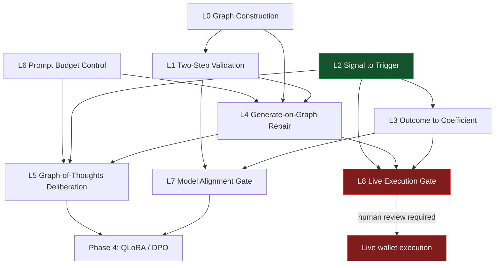

# GRAPH.md — Loop Architecture for Continuing the Systemic Arbitrage Engine

**Status:** proposal · **Created:** 2026-07-26 · **Owner:** Emmanuel Theodore

This document specifies the closed loops required to move the Systemic Arbitrage
Engine from its current state (Phases 1–3 complete, Phase 4 unbuilt) to a
validated, self-correcting system. The loop designs are adapted from the
graph-reasoning literature captured in the source transcript below.

## Provenance

| Source | Location | Status |
|---|---|---|
| `Teaching_language_models_to_reason_with_graphs.m4a` | [`docs/sources/teaching_language_models_to_reason_with_graphs.transcript.txt`](docs/sources/teaching_language_models_to_reason_with_graphs.transcript.txt) | Retrieved 2026-07-26 · 39,312 chars |
| *(second source — not yet named)* | — | **Pending.** The request named a second source but the identifier was empty. Sections marked ⚠ depend on it. |

Notebook: *Graph Learning: From Meta-Learning and Pre-Training to Prompt-Based
Search* (`4a77df2f-8af2-4d9b-b4cb-4053e32cea79`), source
`8b04405d-7068-4cb9-9368-05e1d3afbb34`.

---

## 1. Premise: the framework is already a graph

The Original Power framework carries a latent knowledge graph that no component
currently materializes:

- **Nodes** — 239 registry equations (E001–E239), the symbol registry in
  `variables.yaml`, 146 anchor cases, the five tier sets, contract entries in
  `contract_catalog.yaml`.
- **Edges** — `derives_from` (equation dependency), `calibrates` (case → equation),
  `falsifies` (criterion → equation), `maps_to` (framework variable → market
  contract), `phase_couples` (axis → carrier).

The arbitrage engine consumes a thin slice of this graph through `variables.yaml`
and hard-coded trigger logic. Every loop below either builds that graph, validates
it, or closes a feedback path across it.

The transcript's central architectural claim applies directly: self-attention is a
graph operator, so an LLM fed correctly formatted topology emulates message
passing. The engineering consequence is that **format and hop budget determine
whether a model reasons over the framework or hallucinates fluently about it.**

---

## 2. Current state

| Phase | Component | State |
|---|---|---|
| 1 | `calibrate.py` — Test A (1920–1935), Test B (1966–1971) | Built. Pass conditions directional; several proxies Tier 2/3. |
| 2 | `interference_engine.py`, `spectral.py`, `ingest_trends.py` | Built. Emits `data/live/signal_snapshot.json`. |
| 3 | `trigger_engine.py`, `paper_trader.py`, `polymarket/client.py` | Built. Three triggers live; paper trades to `data/paper_trades.jsonl`. |
| 3 | `live_executor.py` | **Gated.** Raises `NotImplementedError` unless `SYSTEMIC_ARBITRAGE_LIVE=1`. |
| 4 | QLoRA / DPO fine-tuning, live wallet execution | **Unbuilt.** |

Test coverage exists for backtest, calibration map, costs, coefficient fitting,
live executor, paper trader, risk controls. No test covers the interference
engine or trigger engine directly.

---

## 3. Loop catalog

Each loop declares its exit criterion. A loop without a falsifiable exit criterion
runs forever and is disallowed.

### L0 — Graph Construction ⚙️ *foundation*

Materialize the framework knowledge graph as an artifact the other loops query.

- **In:** `variables.yaml`, `Paper/empirical_index.tex`, `equation_explorer/data/equations.json` (239 equations, 22 chapters), `contract_catalog.yaml`
- **Out:** `data/graph/framework_kg.json` — typed triples `(node, edge, node)`
- **Method:** deterministic extraction first. LLM extraction only for edges absent from structured sources, and every LLM-proposed edge enters **L1** before use.
- **Exit:** every equation in the registry appears as a node; every anchor case links to at least one equation; zero orphan nodes.

### L1 — Two-Step Validation 🔁 *cyclic*

The transcript's `two-step chat` loop. Generation and validation are separate
passes over the same model.

- **Step 1 (generative):** extract entities, propose a relational triple from the source text.
- **Step 2 (discriminative):** hand the triple back with the strict prompt — *based strictly on this source text, is this triple true or false?*
- **Rationale:** the transcript reports this cut manual annotation ~65% while preserving structural integrity.
- **Exit:** validated-triple precision ≥ 0.95 on a 100-triple hand-audited holdout. Triples failing step 2 are quarantined, never silently dropped.

### L2 — Signal → Trigger 🔁 *runtime, exists*

`ingest_trends → interference_engine (FFT: P_real ≥90d, O_x 1–7d) → trigger_engine → paper_trader`

- **Gap:** no direct test coverage on `interference_engine.py` or `trigger_engine.py`.
- **Exit:** golden-file tests for all three triggers (Heat Shield Reversal, COINTELPRO Metric, Interference Engine Spike) with frozen fixture snapshots.

### L3 — Outcome → Coefficient 🔁 *learning, partial*

`fit_coefficients.py` already fits α/β from closed paper trades. This is the
pre-DPO loop and should be hardened before any fine-tuning work begins.

- **Exit:** coefficients stable (Δ < 5% across refits) over ≥ 100 closed paper trades; regression test pins fitted values against a frozen trade log.

### L4 — Generate-on-Graph Repair 🔁 *cyclic*

The transcript's `GoG` framework for incomplete knowledge graphs. When a trigger
requires an edge the graph lacks — a contract with no mapped framework variable,
an axis with no calibrated impedance — the model generates the missing triple
from parametric memory and continues.

- **Hard constraint:** a generated edge is tagged `tier: 3, provenance: generated`, must pass **L1**, and **may not influence position sizing** until an anchor case or dataset promotes it to Tier 2. This is the guardrail against the failure mode the transcript names: repairing the bridge while walking across it is powerful and is how a hallucinated edge silently enters a live trade.
- **Exit:** zero `provenance: generated` edges in any executed trade's justification path.

### L5 — Graph-of-Thoughts Deliberation 🔁 *cyclic*

Replace single-pass trade reasoning with the `GoT` pattern: generate multiple
hypotheses per contract in parallel, evaluate, prune incorrect branches, merge
survivors into one decision. Nodes are thoughts; edges are logical dependencies.

- **Exit:** on the backtest set, GoT deliberation matches or beats single-pass trigger output on Sharpe and on false-positive rate. Failing that, this loop is deleted rather than kept.

### L6 — Prompt Budget Control ⚙️ *constraint on L4/L5*

The transcript's hop-budget finding: 2-hop context expands token volume
exponentially and triggers lost-in-the-middle degradation, so wider context
reduced accuracy.

- **Rule:** default 1-hop neighborhoods. Escalate to 2-hop only when 1-hop yields no path, and log every escalation.
- **Also adopt:** BAG prompting — instruct the model to reconstruct the relevant subgraph before reasoning, anchoring attention on the topology.
- **Exit:** measured accuracy at 1-hop ≥ accuracy at 2-hop on a fixed query set, confirming the budget is correctly set.

### L7 — Model Alignment Gate ⚙️ *precondition for Phase 4*

The transcript's most actionable empirical result: the identical knowledge-graph
triples **improved Qwen-2-7B-Instruct** (BLEU 0.366 → 0.531; cosine 0.763 → 0.820)
and **degraded Llama-2-7B-Chat**. The stated cause is instruction-tuning alignment —
a heavily RLHF-tuned conversational model chokes on rigid relational syntax, while
a model tuned on code and structured tables digests it.

- **Consequence:** base-model choice for Phase 4 must be *tested*, not assumed. This directly constrains the existing MLX pipeline in `training/`.
- **Method:** hold out a triple-ingestion eval; score each candidate base model with and without injected triples; select on the delta, not the absolute.
- **Exit:** a ranked table of candidate base models by triple-ingestion delta, committed before any QLoRA run starts.

### L8 — Live Execution Gate 🔒 *blocked*

`live_executor.py` and `polymarket/client.py` both raise `NotImplementedError`.

- **Precondition:** L2, L3, L4 exits all met; risk controls reviewed; Polymarket ToS and regulatory review completed by a human.
- **This loop is not for automated agents.** Left explicitly unassigned below.

---

## 4. Dependency graph

---

## 5. Proposed assignment

Split by the nature of the work: **codex** takes deterministic, well-specified,
test-anchored implementation; **kimi** takes the exploratory, long-context,
literature-grounded design work.

| Loop | Assignee | Rationale |
|---|---|---|
| L0 Graph Construction | **codex** | Deterministic extraction from structured files; clear schema; unit-testable. |
| L1 Two-Step Validation | **kimi** | Prompt design and a precision/recall tradeoff requiring judgment against the source literature. |
| L2 Signal → Trigger tests | **codex** | Pure test-writing against existing behavior; golden files. |
| L3 Outcome → Coefficient hardening | **codex** | Numerical stability and regression pinning. |
| L4 Generate-on-Graph Repair | **kimi** | Novel design; the Tier-3 quarantine guardrail is the hard part and it is a judgment call. |
| L5 Graph-of-Thoughts Deliberation | **kimi** | Exploratory; explicitly permitted to conclude the loop is not worth keeping. |
| L6 Prompt Budget Control | **kimi** | Empirical tuning against the hop-budget finding. |
| L7 Model Alignment Gate | **codex** | Mechanical eval harness over candidate models; the output is a scored table. |
| L8 Live Execution | **unassigned — human only** | Real funds. Outside automated scope by policy. |

**Sequencing:** codex starts L0 immediately (it blocks L1 and L4) and runs L2/L3
in parallel. kimi starts L6 (it constrains L4 and L5) and blocks on L0 for the
rest.

---

## 6. Open questions

1. ⚠ **Second source unidentified.** The request named a second NotebookLM source with an empty identifier. Candidate from the same account: *Loop Engineering* (`22c7c183-02e7-4a66-a0f2-b501b1af61ba`, 63 sources), which matches the "loops" framing. Unconfirmed.
2. **Execution mechanism for the assignment.** `kimi`, `codex`, `gemini` and `cursor-agent` CLIs are all installed, but there is no task-handoff convention in this repo (`.kimi/` holds only `mcp.json`; no `.codex/` exists). See below.
3. **Does L5 earn its cost?** Graph-of-Thoughts deliberation multiplies inference cost per decision. The exit criterion is written to allow deleting it.
4. **KG refresh cadence.** The framework graph changes whenever the manuscript changes. Rebuild on `make index`, or on demand?

---

## 7. Responsible use

Inherited from `systemic_arbitrage/README.md`: this is research software and does
not provide financial advice. Default mode is paper-trading. L8 stays gated behind
`SYSTEMIC_ARBITRAGE_LIVE=1` and human review of Polymarket Terms of Service,
applicable regulation, and project risk policy.
